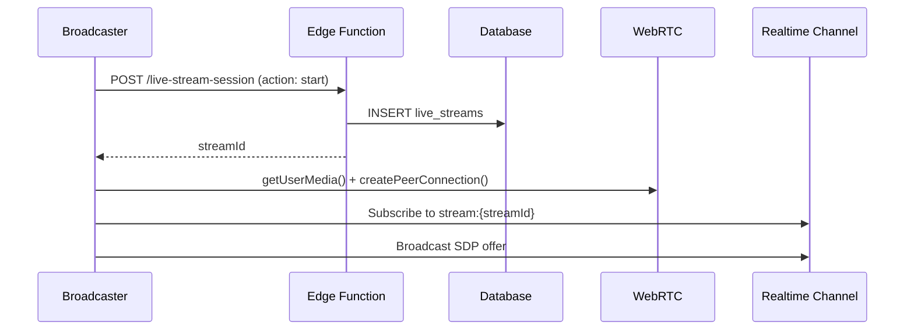
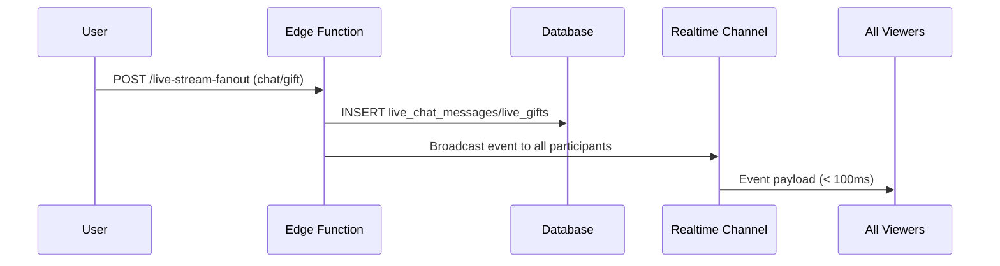

# Live Streaming Architecture (Native WebRTC + Supabase Realtime)

## Architecture Overview

This implementation uses **native WebRTC** for ultra low-latency streaming combined with **Supabase Realtime** for signaling and event fanout. No external services required.

### Key Components

1. **WebRTC Peer Connections** - Direct browser-to-browser media streams
2. **Supabase Realtime** - Signaling server (SDP exchange, ICE candidates)
3. **Edge Functions** - Session management and event fanout
4. **Database** - State persistence (streams, messages, gifts, participants)

## System Flow

### 1. Stream Start (Broadcaster)



### 2. Viewer Join

```mermaid
sequenceDiagram
    Viewer->>Database: SELECT live_streams WHERE status='live'
    Viewer->>Realtime Channel: Subscribe to stream:{streamId}
    Viewer->>WebRTC: createPeerConnection()
    Broadcaster->>Realtime Channel: Broadcast SDP offer
    Viewer->>Realtime Channel: Send SDP answer
    Broadcaster<->Viewer: ICE candidates exchange
    Broadcaster->>Viewer: Media stream (WebRTC direct)
```

### 3. Chat & Gifts Fanout



## Database Schema

Tables already exist:
- `live_streams` - Stream sessions (status, viewer_count, timestamps)
- `live_chat_messages` - Chat messages
- `live_gifts` - Virtual gifts sent during stream
- `live_reactions` - Quick reactions (hearts, etc.)
- `live_stream_participants` - Active/inactive viewers
- `live_duo_invitations` - Duo stream invites

## Edge Functions

### 1. `live-stream-session`
Manages stream lifecycle:
- **start** - Creates live_streams record, returns streamId
- **stop** - Updates status to 'ended'
- **signal** - WebRTC signaling (offers, answers, ICE candidates)
- **update-viewers** - Updates viewer_count

### 2. `live-stream-fanout`
Handles real-time events:
- **chat** - Fanout chat messages to all viewers
- **gift** - Fanout gift animations
- **reaction** - Fanout emoji reactions
- **viewer-joined/left** - Update participant list

## Client Integration

### React Components (Existing)

1. **LiveStreamBroadcaster** - Start streaming (broadcaster side)
   - getUserMedia() for camera/mic
   - Create WebRTC PeerConnection
   - Send SDP via Realtime

2. **LiveStreamPlayer** - Watch stream (viewer side)
   - Subscribe to Realtime channel
   - Receive SDP offers
   - Display media stream

3. **LiveChatBox** - Chat interface
4. **GiftPanel** - Send virtual gifts
5. **TikTokLiveChatOverlay** - Animated chat overlay

### React Hooks (Existing)

- `useLiveStreams` - Fetch/manage streams
- `useLiveChat` - Send/receive chat
- `useLiveGifts` - Send gifts
- `useLiveParticipants` - Track viewers
- `useLiveDuo` - Duo streaming

## WebRTC Configuration

### STUN/TURN Servers
Use free public STUN servers for NAT traversal:

```javascript
const rtcConfig = {
  iceServers: [
    { urls: 'stun:stun.l.google.com:19302' },
    { urls: 'stun:stun1.l.google.com:19302' },
    { urls: 'stun:stun2.l.google.com:19302' },
  ]
};
```

For production with complex NATs, consider adding TURN servers (can use Cloudflare's free tier or coturn self-hosted).

## Performance Targets

### Latency (P50)
- **Chat messages**: < 300ms (Supabase Realtime)
- **Gifts**: < 500ms (animation + fanout)
- **Video stream**: < 3s (WebRTC peer connection)

### Scalability
- **1-to-many**: 1 broadcaster → 1,000 viewers
- **WebRTC limitations**: Direct P2P doesn't scale beyond ~10 peers
- **Solution**: Use SFU pattern (broadcaster → server → viewers)

#### SFU Pattern (for 1k+ viewers)

```
Broadcaster → Edge Function (acts as SFU) → Viewers
                  ↓
            Supabase Realtime
```

For large audiences, implement a lightweight SFU in the edge function to relay streams instead of direct P2P.

## Fallback: RTMP → HLS

For audiences > 5k viewers or where WebRTC isn't supported:

1. Broadcaster streams RTMP to external service (e.g., Cloudflare Stream, Mux)
2. External service generates HLS playlist
3. Viewers consume HLS (higher latency ~10-30s, but scales infinitely)

## Load Testing

### Test Scenarios

1. **1k concurrent viewers**
   - Spawn 1k WebSocket connections to Realtime channel
   - Measure message fanout latency
   - Monitor database connections

2. **5k concurrent viewers**
   - Test with simulated SFU relay
   - Measure CPU/memory on edge functions
   - Check database query performance

### Testing Tools

```bash
# WebSocket stress test
npm install -g artillery
artillery run live-stream-load-test.yml

# Database load test
pgbench -c 100 -j 10 -t 1000 <database_url>
```

### Metrics to Track

- **Latency**: P50, P95, P99 for chat/gifts
- **Throughput**: Messages per second
- **Connection stability**: WebSocket reconnection rate
- **Database**: Query time, connection pool usage

## Deployment Checklist

- [x] Database tables exist (live_streams, live_chat_messages, etc.)
- [x] Edge functions deployed (live-stream-session, live-stream-fanout)
- [x] Realtime enabled on tables (live_chat_messages, live_gifts)
- [x] React components integrated (LiveStreamBroadcaster, LiveStreamPlayer)
- [ ] Load testing completed (1k, 5k viewers)
- [ ] Monitoring dashboard (latency, viewer count, errors)
- [ ] TURN server configured (for production NAT traversal)

## Next Steps

1. **Phase 1 (Current)**: Basic WebRTC + Realtime (1-to-100 viewers)
2. **Phase 2**: SFU pattern for 1k+ viewers
3. **Phase 3**: RTMP → HLS fallback for 5k+ viewers
4. **Phase 4**: Duo streaming (2 broadcasters)

## Security Considerations

- **Authentication**: All edge functions check `auth.getUser()`
- **RLS Policies**: Ensure proper row-level security on live_streams tables
- **Rate Limiting**: Prevent spam in chat/gifts (implement in edge functions)
- **Token Validation**: Validate streamId ownership before allowing start/stop

## Cost Optimization

- **Supabase Realtime**: Free tier supports 200 concurrent connections, $10/month for 500
- **Edge Functions**: Free tier 500k invocations/month
- **Database**: Monitor connection pooling to avoid exhaustion
- **WebRTC**: No bandwidth costs (direct P2P), but TURN relay costs apply if used

## References

- [WebRTC API](https://developer.mozilla.org/en-US/docs/Web/API/WebRTC_API)
- [Supabase Realtime](https://supabase.com/docs/guides/realtime)
- [Building a SFU with WebRTC](https://webrtc.org/getting-started/media-devices)
