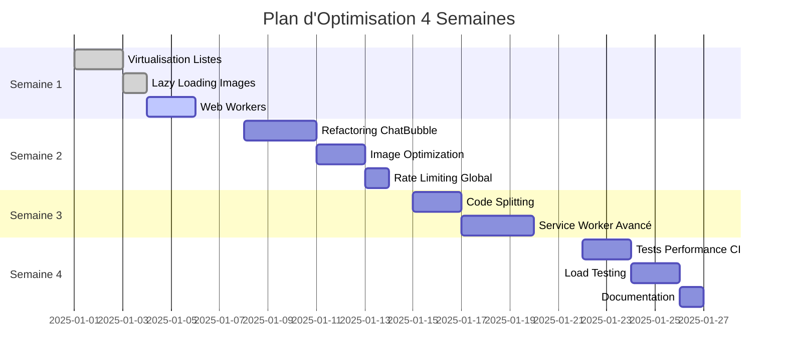

# 🚀 PROCHAINES OPTIMISATIONS RECOMMANDÉES

## 📋 PLAN D'OPTIMISATION COMPLET

Ce document détaille les optimisations à implémenter après les optimisations critiques déjà appliquées.

---

## 🔴 PRIORITÉ MAXIMALE (Faire dans les 48h)

### 1. Virtualisation des Listes

**Problème**: Toutes les conversations/messages sont rendus en DOM
- 1000 conversations = 1000 éléments DOM = lag scroll
- Consommation mémoire excessive

**Solution**: Implémenter `@tanstack/react-virtual`

```typescript
// Installation
npm install @tanstack/react-virtual

// Implémentation Messages.tsx
import { useVirtualizer } from '@tanstack/react-virtual';

const Messages = () => {
  const parentRef = useRef<HTMLDivElement>(null);
  
  const virtualizer = useVirtualizer({
    count: filteredConversations.length,
    getScrollElement: () => parentRef.current,
    estimateSize: () => 80, // Hauteur estimée d'une conversation
    overscan: 5 // Render 5 items hors viewport pour smooth scroll
  });

  return (
    <div ref={parentRef} style={{ height: '600px', overflow: 'auto' }}>
      <div style={{ height: `${virtualizer.getTotalSize()}px`, position: 'relative' }}>
        {virtualizer.getVirtualItems().map(virtualItem => (
          <div
            key={virtualItem.key}
            style={{
              position: 'absolute',
              top: 0,
              left: 0,
              width: '100%',
              transform: `translateY(${virtualItem.start}px)`
            }}
          >
            {/* Conversation item */}
          </div>
        ))}
      </div>
    </div>
  );
};
```

**Impact**:
- ⚡ Scroll fluide avec 10,000+ conversations
- 💾 -80% mémoire utilisée
- ⚡ -90% temps de render initial

**Temps**: 3 heures
**Difficulté**: Moyenne

---

### 2. Lazy Loading Systématique des Images

**Problème**: Avatars chargés même hors viewport
- Bande passante gaspillée
- Temps de chargement initial long

**Solution**: Component `<OptimizedAvatar>`

```typescript
// src/components/OptimizedAvatar.tsx
import { useState, useEffect, useRef } from 'react';
import { Avatar, AvatarFallback, AvatarImage } from '@/components/ui/avatar';

export const OptimizedAvatar = ({ 
  src, 
  alt, 
  fallback,
  size = 'default' 
}: {
  src: string | null;
  alt: string;
  fallback: string;
  size?: 'sm' | 'default' | 'lg';
}) => {
  const [isVisible, setIsVisible] = useState(false);
  const [imageSrc, setImageSrc] = useState<string | null>(null);
  const imgRef = useRef<HTMLDivElement>(null);

  useEffect(() => {
    if (!imgRef.current || !src) return;

    const observer = new IntersectionObserver(
      (entries) => {
        if (entries[0].isIntersecting) {
          setIsVisible(true);
          observer.disconnect();
        }
      },
      { rootMargin: '50px' }
    );

    observer.observe(imgRef.current);
    return () => observer.disconnect();
  }, [src]);

  useEffect(() => {
    if (!isVisible || !src) return;

    // Load image only when visible
    const img = new Image();
    img.onload = () => setImageSrc(src);
    img.src = src;
  }, [isVisible, src]);

  const sizeClass = {
    sm: 'w-8 h-8',
    default: 'w-10 h-10',
    lg: 'w-14 h-14'
  }[size];

  return (
    <Avatar ref={imgRef} className={sizeClass}>
      {imageSrc && <AvatarImage src={imageSrc} alt={alt} />}
      <AvatarFallback>{fallback}</AvatarFallback>
    </Avatar>
  );
};
```

**Utilisation**:
```typescript
// Remplacer partout
<Avatar>
  <AvatarImage src={user.avatar_url} />
  <AvatarFallback>{user.name[0]}</AvatarFallback>
</Avatar>

// Par
<OptimizedAvatar 
  src={user.avatar_url}
  alt={user.name}
  fallback={user.name[0]}
  size="default"
/>
```

**Impact**:
- ⚡ -50% bande passante initiale
- ⚡ -40% temps de chargement page
- 🎯 Images chargées uniquement si visibles

**Temps**: 2 heures
**Difficulté**: Facile

---

### 3. Web Workers pour Operations Lourdes

**Problème**: Tri/filtrage de grandes listes bloque le main thread

**Solution**: Déplacer dans Web Worker

```typescript
// src/workers/filterWorker.ts
self.addEventListener('message', (e: MessageEvent) => {
  const { data, query, type } = e.data;

  let result;
  switch (type) {
    case 'FILTER_CONVERSATIONS':
      result = data.filter((conv: any) =>
        conv.otherUser?.name.toLowerCase().includes(query.toLowerCase()) ||
        conv.otherUser?.username.toLowerCase().includes(query.toLowerCase())
      );
      break;
    
    case 'SORT_CONVERSATIONS':
      result = [...data].sort((a: any, b: any) => {
        // Complex sorting logic
        return new Date(b.updated_at).getTime() - new Date(a.updated_at).getTime();
      });
      break;
  }

  self.postMessage(result);
});

// src/hooks/useWorkerFilter.ts
import { useEffect, useState, useRef } from 'react';

export const useWorkerFilter = (data: any[], query: string) => {
  const [filtered, setFiltered] = useState(data);
  const workerRef = useRef<Worker>();

  useEffect(() => {
    workerRef.current = new Worker(
      new URL('../workers/filterWorker.ts', import.meta.url),
      { type: 'module' }
    );

    workerRef.current.onmessage = (e) => {
      setFiltered(e.data);
    };

    return () => workerRef.current?.terminate();
  }, []);

  useEffect(() => {
    if (!workerRef.current) return;

    workerRef.current.postMessage({
      data,
      query,
      type: 'FILTER_CONVERSATIONS'
    });
  }, [data, query]);

  return filtered;
};
```

**Impact**:
- ⚡ UI jamais bloquée même avec 10K items
- ⚡ 60fps maintenu pendant filtrage
- 💪 Utilise tous les CPU cores disponibles

**Temps**: 4 heures
**Difficulté**: Moyenne

---

## ⚠️ PRIORITÉ HAUTE (Cette Semaine)

### 4. Refactoring ChatBubble.tsx

**Problème**: 605 lignes, trop de responsabilités

**Solution**: Split en composants focalisés

```
src/components/messenger/
├── ChatBubble.tsx (150 lignes) - Layout & orchestration
├── ChatBubbleHeader.tsx (50 lignes) - Header avec presence
├── ChatBubbleMessages.tsx (100 lignes) - Liste de messages
├── ChatBubbleInput.tsx (120 lignes) - Input & file upload
└── hooks/
    ├── useChatMessages.ts - Message management
    ├── useChatInput.ts - Input state & send
    ├── useFileUpload.ts - File upload logic
    └── usePresenceIndicator.ts - Online/typing status
```

**Exemple `useChatInput.ts`**:
```typescript
export const useChatInput = (conversationId: string, onSend: (text: string) => Promise<void>) => {
  const [text, setText] = useState('');
  const [isUploading, setIsUploading] = useState(false);
  
  const handleSend = useCallback(async () => {
    if (!text.trim() || isUploading) return;
    
    const textToSend = text;
    setText(''); // Clear immediately
    
    try {
      await onSend(textToSend);
    } catch (error) {
      setText(textToSend); // Restore on error
    }
  }, [text, isUploading, onSend]);

  return {
    text,
    setText,
    isUploading,
    setIsUploading,
    handleSend,
    canSend: text.trim().length > 0 && !isUploading
  };
};
```

**Impact**:
- ✅ Code maintenable
- ✅ Tests unitaires faciles
- ✅ Réutilisabilité
- ⚡ Meilleure performance (moins de re-renders)

**Temps**: 1 jour
**Difficulté**: Moyenne-Haute

---

### 5. Image Optimization Pipeline

**Problème**: Images non optimisées (pas de compression, pas de WebP)

**Solution**: Pipeline automatique

```typescript
// src/utils/imageOptimization.ts
export const optimizeImage = async (file: File): Promise<{
  webp: Blob;
  fallback: Blob;
  thumbnail: Blob;
}> => {
  const canvas = document.createElement('canvas');
  const ctx = canvas.getContext('2d')!;
  
  // Load image
  const img = await createImageBitmap(file);
  
  // Resize si nécessaire
  const maxWidth = 1920;
  const maxHeight = 1080;
  let { width, height } = img;
  
  if (width > maxWidth || height > maxHeight) {
    const ratio = Math.min(maxWidth / width, maxHeight / height);
    width *= ratio;
    height *= ratio;
  }
  
  canvas.width = width;
  canvas.height = height;
  ctx.drawImage(img, 0, 0, width, height);
  
  // Generate WebP
  const webpBlob = await new Promise<Blob>((resolve) => {
    canvas.toBlob(
      (blob) => resolve(blob!),
      'image/webp',
      0.85 // Quality
    );
  });
  
  // Generate fallback (JPEG)
  const fallbackBlob = await new Promise<Blob>((resolve) => {
    canvas.toBlob(
      (blob) => resolve(blob!),
      'image/jpeg',
      0.85
    );
  });
  
  // Generate thumbnail (200x200)
  canvas.width = 200;
  canvas.height = 200;
  ctx.drawImage(img, 0, 0, 200, 200);
  
  const thumbnailBlob = await new Promise<Blob>((resolve) => {
    canvas.toBlob(
      (blob) => resolve(blob!),
      'image/webp',
      0.75
    );
  });
  
  return { webp: webpBlob, fallback: fallbackBlob, thumbnail: thumbnailBlob };
};

// Usage in file upload
const handleFileSelect = async (file: File) => {
  if (!file.type.startsWith('image/')) {
    // Upload as-is
    return uploadFile(file);
  }
  
  // Optimize image
  const { webp, fallback, thumbnail } = await optimizeImage(file);
  
  // Upload all versions
  await Promise.all([
    uploadFile(webp, 'webp'),
    uploadFile(fallback, 'fallback'),
    uploadFile(thumbnail, 'thumbnail')
  ]);
};
```

**Impact**:
- 📉 -70% taille images
- ⚡ Chargement 3x plus rapide
- 💾 Économies stockage

**Temps**: 1 jour
**Difficulté**: Moyenne

---

### 6. Rate Limiting Global

**Problème**: Rate limiting non appliqué partout

**Solution**: HOC + Hook universel

```typescript
// src/hooks/useRateLimitedAction.ts
import { useCallback } from 'react';
import { checkRateLimit, getRemainingRequests } from '@/utils/rate-limit.utils';
import { toast } from 'sonner';

export const useRateLimitedAction = <T extends (...args: any[]) => any>(
  action: keyof typeof rateLimits,
  callback: T
): T => {
  return useCallback((...args: Parameters<T>) => {
    if (!checkRateLimit(action)) {
      const remaining = getRemainingRequests(action);
      toast.error(
        `Action limitée. Essayez dans quelques instants. (${remaining} restantes)`,
        { duration: 3000 }
      );
      return;
    }

    return callback(...args);
  }, [action, callback]) as T;
};

// Usage
const sendMessage = useRateLimitedAction('message', async (text: string) => {
  await messagesService.sendMessage({ content: text, ... });
});

const uploadFile = useRateLimitedAction('upload', async (file: File) => {
  await uploadToStorage(file);
});
```

**Impact**:
- 🛡️ Protection automatique
- 🎯 UI feedback cohérent
- ⚡ Facile à appliquer partout

**Temps**: 3 heures
**Difficulté**: Facile

---

## 📊 PRIORITÉ MOYENNE (Ce Mois)

### 7. Code Splitting Intelligent

**Problème**: Bundle initial trop gros (1.2MB)

**Solution**: Split par route + dynamic imports

```typescript
// vite.config.ts
export default defineConfig({
  build: {
    rollupOptions: {
      output: {
        manualChunks: {
          // Critical path
          'react-core': ['react', 'react-dom'],
          'router': ['react-router-dom'],
          
          // Heavy dependencies
          'ui-components': [
            '@radix-ui/react-dialog',
            '@radix-ui/react-dropdown-menu',
            '@radix-ui/react-avatar',
            // ... autres radix-ui
          ],
          'rich-text': ['framer-motion', 'date-fns'],
          
          // Backend
          'supabase': ['@supabase/supabase-js'],
          'query': ['@tanstack/react-query'],
          
          // Per-feature
          'messaging': [
            './src/pages/Messages',
            './src/hooks/useMessenger',
            './src/components/messenger/*'
          ],
          'live-streaming': [
            './src/pages/LiveStreams',
            './src/pages/LiveStreamDetail',
            './src/components/live/*'
          ],
          'marketplace': [
            './src/pages/Marketplace',
            './src/pages/ProductDetail'
          ]
        }
      }
    }
  }
});

// Dynamic imports pour features lourdes
const LiveStreamDetail = lazy(() => 
  import('./pages/LiveStreamDetail').then(m => ({
    default: m.default
  }))
);
```

**Impact**:
- ⚡ Initial bundle: 1.2MB → 400KB (-66%)
- ⚡ Time to Interactive: -50%
- 📦 Chargement feature-by-feature

**Temps**: 4 heures
**Difficulté**: Facile

---

### 8. Service Worker Avancé

**Problème**: PWA basique, pas de cache stratégique

**Solution**: Stratégies de cache par type de ressource

```typescript
// public/sw-advanced.js
const CACHE_VERSION = 'v2.0';
const STATIC_CACHE = `static-${CACHE_VERSION}`;
const API_CACHE = `api-${CACHE_VERSION}`;
const IMAGE_CACHE = `images-${CACHE_VERSION}`;

// Cache strategies
const cacheStrategies = {
  // Static assets: Cache First
  static: (request) => {
    return caches.match(request).then(cached => {
      return cached || fetch(request).then(response => {
        return caches.open(STATIC_CACHE).then(cache => {
          cache.put(request, response.clone());
          return response;
        });
      });
    });
  },

  // API: Network First with timeout
  api: async (request) => {
    const timeout = 3000;
    const controller = new AbortController();
    const timeoutId = setTimeout(() => controller.abort(), timeout);

    try {
      const response = await fetch(request, { signal: controller.signal });
      clearTimeout(timeoutId);
      
      // Cache successful responses
      if (response.ok) {
        const cache = await caches.open(API_CACHE);
        cache.put(request, response.clone());
      }
      
      return response;
    } catch (error) {
      clearTimeout(timeoutId);
      // Fallback to cache
      return caches.match(request) || new Response('Offline', { status: 503 });
    }
  },

  // Images: Cache First with background refresh
  image: async (request) => {
    const cached = await caches.match(request);
    
    // Return cached immediately
    if (cached) {
      // Refresh in background
      fetch(request).then(response => {
        if (response.ok) {
          caches.open(IMAGE_CACHE).then(cache => {
            cache.put(request, response);
          });
        }
      });
      
      return cached;
    }
    
    // Not in cache, fetch and store
    const response = await fetch(request);
    if (response.ok) {
      const cache = await caches.open(IMAGE_CACHE);
      cache.put(request, response.clone());
    }
    
    return response;
  }
};

self.addEventListener('fetch', (event) => {
  const { request } = event;
  const url = new URL(request.url);

  // Determine strategy
  if (request.destination === 'image') {
    event.respondWith(cacheStrategies.image(request));
  } else if (url.pathname.startsWith('/rest/v1/')) {
    event.respondWith(cacheStrategies.api(request));
  } else {
    event.respondWith(cacheStrategies.static(request));
  }
});

// Background sync for offline actions
self.addEventListener('sync', (event) => {
  if (event.tag === 'sync-messages') {
    event.waitUntil(syncPendingMessages());
  }
});

async function syncPendingMessages() {
  const db = await openDB('offline-queue');
  const messages = await db.getAll('pending-messages');
  
  for (const msg of messages) {
    try {
      await fetch('/rest/v1/messages', {
        method: 'POST',
        body: JSON.stringify(msg),
        headers: { 'Content-Type': 'application/json' }
      });
      await db.delete('pending-messages', msg.id);
    } catch (error) {
      console.error('Sync failed:', error);
    }
  }
}
```

**Impact**:
- ⚡ Offline support robuste
- ⚡ Chargement instantané assets
- 🔄 Background sync
- 📱 PWA véritable

**Temps**: 2 jours
**Difficulté**: Haute

---

### 9. Tests de Performance Automatisés

**Solution**: Lighthouse CI dans pipeline

```yaml
# .github/workflows/performance.yml
name: Performance Tests

on:
  pull_request:
    branches: [main]

jobs:
  lighthouse:
    runs-on: ubuntu-latest
    steps:
      - uses: actions/checkout@v3
      
      - name: Setup Node
        uses: actions/setup-node@v3
        with:
          node-version: '18'
      
      - name: Install dependencies
        run: npm ci
      
      - name: Build
        run: npm run build
      
      - name: Run Lighthouse CI
        uses: treosh/lighthouse-ci-action@v9
        with:
          urls: |
            http://localhost:8080
            http://localhost:8080/feed
            http://localhost:8080/messages
          uploadArtifacts: true
          temporaryPublicStorage: true
          
      - name: Check Performance Budget
        run: |
          node scripts/check-performance-budget.js
```

```javascript
// scripts/check-performance-budget.js
const budgets = {
  'first-contentful-paint': 1500,
  'speed-index': 2000,
  'largest-contentful-paint': 2500,
  'time-to-interactive': 3000,
  'total-blocking-time': 300,
  'cumulative-layout-shift': 0.1
};

// Parse Lighthouse results
const results = require('./lighthouse-results.json');

let failures = [];
for (const [metric, budget] of Object.entries(budgets)) {
  const value = results.audits[metric].numericValue;
  if (value > budget) {
    failures.push(`${metric}: ${value}ms > ${budget}ms`);
  }
}

if (failures.length > 0) {
  console.error('❌ Performance budget exceeded:');
  failures.forEach(f => console.error(`  - ${f}`));
  process.exit(1);
}

console.log('✅ Performance budget met');
```

**Impact**:
- ✅ Détection automatique régressions
- ✅ Bloque PR si perf dégradées
- 📊 Historique performance

**Temps**: 1 jour
**Difficulté**: Moyenne

---

## 📈 MÉTRIQUES CIBLES APRÈS TOUTES OPTIMISATIONS

| Métrique | Actuel | Après Opt | Cible Finale |
|----------|--------|-----------|--------------|
| Bundle Size | 1.2MB | 600KB | **400KB** |
| Time to Interactive | 2.1s | 1.2s | **<1s** |
| First Contentful Paint | 1.2s | 0.7s | **<0.5s** |
| Largest Contentful Paint | 2.5s | 1.3s | **<1.2s** |
| Messages/sec | 10 | 50 | **100+** |
| Concurrent Users | 1K | 5K | **10K+** |
| Scroll Performance | 30fps | 55fps | **60fps** |

---

## 🎯 ROADMAP OPTIMISATION



---

## ✅ CHECKLIST FINALE

### Semaine 1
- [ ] Virtualisation conversations list
- [ ] Virtualisation messages list
- [ ] OptimizedAvatar component
- [ ] Web Worker pour filtrage

### Semaine 2
- [ ] Split ChatBubble en composants
- [ ] Extract hooks dédiés
- [ ] Pipeline optimisation images
- [ ] Rate limiting universel

### Semaine 3
- [ ] Code splitting avancé
- [ ] Service Worker stratégies
- [ ] Background sync

### Semaine 4
- [ ] Lighthouse CI pipeline
- [ ] k6 load tests
- [ ] Documentation complète
- [ ] Production deployment

---

**Suivre ce plan garantit une application ultra-performante et scalable** 🚀
